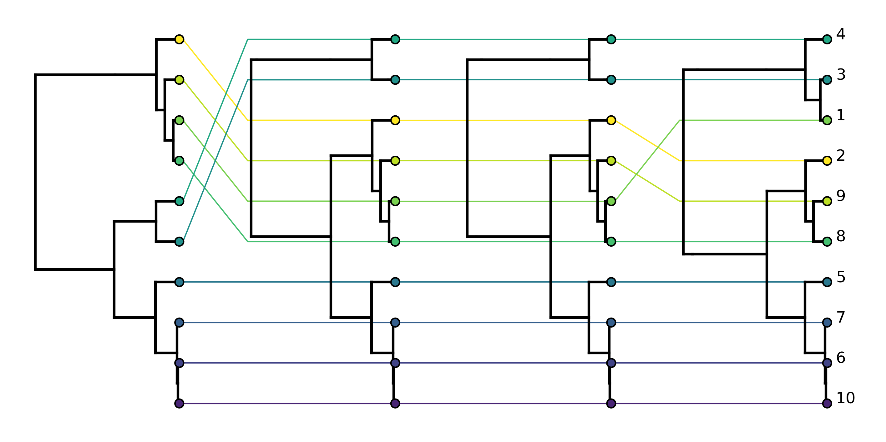
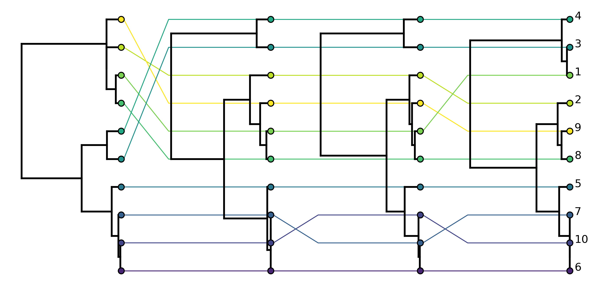
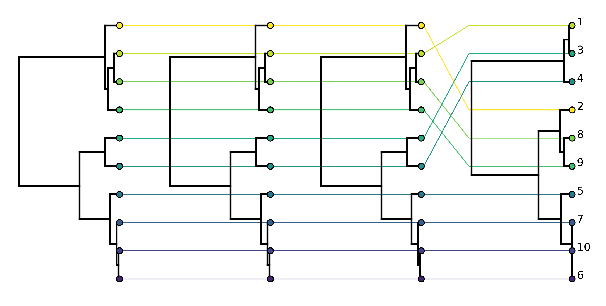

.. _primer:

Espalier Primer
===============

Installation
*************

Espalier can easily be installed through `pip <https://pypi.org/project/pip/>`_:
::

	$ pip install Espalier

pip will install all the other Python packages. However, to use Espalier you will also need to have RAxML-NG installed. Please see these `instructions <https://github.com/amkozlov/raxml-ng>`_.

Computing Maximum Agreement Forests
***********************************

Espalier is largely built on maximum agreement forests. In general, an agreement forest between two discordant phylogenetic trees is obtained by cutting edges/branches until all subtrees in the resulting forest are topologically concordant, meaning that the relationships among taxa in each subtree agree between the two starting trees. A maximum agreement forest (MAF) is the agreement forest obtained by making the fewest possible cuts and thus contains the fewest possible concordant subtrees that agree between the starting trees. 

Here we will compute the MAF between two discordant trees *tree1* and *tree2* available in the ``examples`` folder. First import the ``MAF`` module along with DendroPy:
::

	from Espalier import MAF
	import dendropy

Then import *tree1* as a DendroPy :class:`Tree` object:
::

	tree1_file = './maf_example_tree1.tre'
	taxa = dendropy.TaxonNamespace()
	tree1 = dendropy.Tree.get(file=open(tree1_file, 'r'), schema="newick", rooting="default-rooted", taxon_namespace=taxa)

We can then import *tree2* in the same way noting that we pass the same :class:`TaxonNamespace` object ``taxa`` so that the tips in *tree2* can be mapped to the equivalent tips with the same taxon names in *tree1*.
::

	tree2_file = './maf_example_tree2.tre'
	tree2 = dendropy.Tree.get(file=open(tree2_file, 'r'), schema="newick", rooting="default-rooted", taxon_namespace=taxa)

DendroPy's :meth:`Tree.print_plot()` function provides a simple way to view trees as basic ASCII text plots. Let's plot the trees side by side to compare their topology.::

	print("Tree 1:")
	tree1.print_plot()

	print("Tree 2:")
	tree2.print_plot()

This should plot *tree1*:
::

	Tree 1:
	                                                            /--------------- 1 
	/-----------------------------------------------------------+                  
	|                                                           \--------------- 2 
	|                                                                              
	|                             /--------------------------------------------- 3 
	+              /--------------+                                                
	|              |              |              /------------------------------ 10
	|              |              \--------------+                                 
	|              |                             |              /--------------- 4 
	\--------------+                             \--------------+                  
	               |                                            \--------------- 8 
	               |                                                               
	               |              /--------------------------------------------- 5 
	               \--------------+                                                
	                              |              /------------------------------ 9 
	                              \--------------+                                 
	                                             |              /--------------- 6 
	                                             \--------------+                  
	                                                            \--------------- 7 

Then *tree2*:
::

	Tree 2:
	                   /-------------------------------------------------------- 3 
	/------------------+                                                           
	|                  |                  /------------------------------------- 10
	|                  \------------------+                                        
	|                                     |                  /------------------ 4 
	|                                     \------------------+                     
	|                                                        \------------------ 8 
	+                                                                              
	|                                                        /------------------ 1 
	|                                     /------------------+                     
	|                                     |                  \------------------ 2 
	|                  /------------------+                                        
	|                  |                  |                  /------------------ 6 
	|                  |                  \------------------+                     
	\------------------+                                     \------------------ 7 
	                   |                                                           
	                   |                                     /------------------ 5 
	                   \-------------------------------------+                     
	                                                         \------------------ 9 

We can now clearly see that these trees are topologically discordant. Subtree **(1,2)** is sister to all other taxa in *tree1* but sister to only subtree **(6,7)** in *tree2*. Also, taxon **5** is sister to subtree **(9,(6,7))** in *tree1* but sister to only **9** in *tree2*.

To compute the MAF between these two trees, we can use :meth:`get_maf` in the ``MAF`` module.
::

	maf = MAF.get_maf(tree1,tree2)

Then print all subtrees in the returned forest using :meth:`plot_maf`: 
::

	from Espalier.MAF import plot_maf
	plot_maf(maf)

This should plot the computed MAF:
::

	-------------------------
	Maximum agreement forest:
	-------------------------

	/---------------------------------------------------------------------------- 1
	+                                                                              
	\---------------------------------------------------------------------------- 2
	                                                                               
	                                                                               

	---5

	                   /-------------------------------------------------------- 3 
	/------------------+                                                           
	|                  |                  /------------------------------------- 10
	|                  \------------------+                                        
	|                                     |                  /------------------ 4 
	+                                     \------------------+                     
	|                                                        \------------------ 8 
	|                                                                              
	|                                                        /------------------ 6 
	|                                     /------------------+                     
	\-------------------------------------+                  \------------------ 7 
	                                      |                                        
	                                      \------------------------------------- 9

It may not be immediately obvious that the forest returned by the algorithm is the true MAF. However, cutting subtree **(1,2)** and taxon **5** results in one large remaining subtree that is topologically consistent between the starting trees. Meanwhile, cutting any other edge besides these two will result in discordant subtrees remaining. Thus, the returned agreement forest is the true MAF in this case because it contains the fewest possible cut subtrees necessary to reconcile *tree1* and *tree2*.

Note, MAFs can also be computed using Espalier's :ref:`commandline`.

Computing SPR distances
***********************

A subtree-prune-and-regraft (SPR) move cuts or prunes a subtree from one edge in a tree and regrafts that subtree to another edge elsewhere in the tree. SPR distances are a useful way to summarize the topological distance between trees in terms of the number of subtree transfers separating two trees. Moreover, since the topological effect of a single recombination event is similar to a SPR move in that a recombining lineage will attach to two different parent lineages to the left and right of a recombination breakpoint, computing SPR distances also tells us the minimum number of recombination events necessary to explain the discordance between two trees.

The SPR distance between two trees is simple to compute given their MAF, we just need to count the number of cut subtrees in the MAF. If there are *n* component subtrees in a MAF, the SPR distance is *n-1* because we do not count the final connected component. The ``MAF`` module in Espalier provides a convenient function for computing SPR distances between trees with :meth:`get_spr_dist`.

We can compute the SPR distance between trees *tree1* and *tree2* from the MAF example above. 
::

	spr_dist = MAF.get_spr_dist(tree1,tree2)
	print("SPR distance: " + str(spr_dist)) 

This should print:
::

	SPR distance: 2

Note that this is equivalent to counting the number of subtrees in the MAF and subtracting one:
::

	maf = MAF.get_maf(tree1,tree2)
	maf_spr_dist = len(maf) - 1
	print("SPR distance: " + str(maf_spr_dist))

This should likewise print:
::

	SPR distance: 2

SPR distances can also be computed using the :ref:`commandline`.

Tree reconciliation through MAFs
********************************

MAFs can also be used to reconcile two discordant trees. To see the motivation behind Espalier's reconciliation algorithm, consider reconstructing *local trees* from different regions of a genome. Ideally, we would like to resolve conflicts between local trees attributable to phylogenetic error/noise while retaining conflicts that are strongly supported by the sequence data that likely represent true discordance due to recombination.   

Here we will consider two genomic regions where *region 1* (900bp) is much longer than *region 2* (100bp). We can reconstruct maximum likelihood (ML) trees (e.g. using RAxML) from the sequence data corresponding to each genomic region and then compare the topology of the two ML trees. 
::

	import dendropy
	from Espalier import MAF

	ML_tree_file_r1 = 'reconciler_MLTree_r1.tre'
	ML_tree_file_r2 = 'reconciler_MLTree_r2.tre'  

	taxa = dendropy.TaxonNamespace()
	tree_r1 = dendropy.Tree.get(file=open(ML_tree_file_r1, 'r'), schema="newick", rooting="default-rooted", taxon_namespace=taxa)
	tree_r2 = dendropy.Tree.get(file=open(ML_tree_file_r2, 'r'), schema="newick", rooting="default-rooted", taxon_namespace=taxa)

	print("Tree 1:")
	tree_r1.print_plot()

	print("Tree 2:")
	tree_r2.print_plot()

	print('SPR distance:', str(MAF.get_spr_dist(tree_r1,tree_r2)))

Running the above code outputs:
::

	Tree 1:
	               /------------------------------------------------------------ 10
	/--------------+                                                               
	|              |              /--------------------------------------------- 5 
	|              \--------------+                                                
	|                             |              /------------------------------ 4 
	|                             \--------------+                                 
	|                                            |              /--------------- 3 
	+                                            \--------------+                  
	|                                                           \--------------- 8 
	|                                                                              
	|                                                           /--------------- 7 
	|                             /-----------------------------+                  
	|                             |                             \--------------- 2 
	\-----------------------------+                                                
	                              |                             /--------------- 6 
	                              |              /--------------+                  
	                              \--------------+              \--------------- 9 
	                                             |                                 
	                                             \------------------------------ 1 
	                                                                               
	                                                                               
	Tree 2:
	                                                            /--------------- 7 
	                              /-----------------------------+                  
	                              |                             \--------------- 9 
	/-----------------------------+                                                
	|                             |                             /--------------- 1 
	|                             |              /--------------+                  
	|                             \--------------+              \--------------- 6 
	|                                            |                                 
	|                                            \------------------------------ 2 
	+                                                                              
	|                                            /------------------------------ 5 
	|                             /--------------+                                 
	|                             |              |              /--------------- 8 
	|              /--------------+              \--------------+                  
	|              |              |                             \--------------- 3 
	\--------------+              |                                                
	               |              \--------------------------------------------- 4 
	               |                                                               
	               \------------------------------------------------------------ 10
	                                                                               
	                                                                               
	SPR distance: 3

The SPR distance between trees is 3, indicating that the trees have fairly different topologies. But we have good reason to expect that some of the discordance may be due to errors in tree reconstruction, especially for *local tree 2* since *region 2* is only 100bp long. 

We will therefore try to reconcile these two trees through their MAF. Espalier's tree reconciliation algorithm starts with the MAF between two discordant trees and iteratively regrafts each subtree cut to obtain the MAF back to their original parent edges in either starting trees. This creates two alternative (partially) reconciled trees at each iteration of the algorithm; leading to a bifurcating search tree with 2^n possible reconciled trees. Since we generally only want to consider reconciled trees that are strongly supported by the sequence data, we can set a parameter called ``lower_bound_ratio`` which determines whether or not a search path extending from a tree is searched. Specifically, setting the ``lower_bound_ratio`` to 0.1 means that we will terminate a search path extending from a tree if the likelihood of the sequence data given that tree is 10X lower than the likelihood given the other alternative tree.

To run the reconciliation algorithm, we must first initialize a :class:`RAxMLRunner` object which uses RAxML-NG to compute the likelihood of the sequence data and a callable :class:`Reconciler` object.
::

	from Espalier.Reconciler import Reconciler
	from Espalier.RAxML import RAxMLRunner
	from Espalier import MAF

	raxml = RAxMLRunner(raxml_path='raxml-ng') # provide path to RAxML if not 'raxml-ng'
	reconciler = Reconciler(raxml,lower_bound_ratio=0.1)

We can then reconcile the two ML trees through their MAF while retaining conflicts supported by the sequence data for *region 2*:
::

	# Reconcile ML trees through their MAF
	maf = MAF.get_maf_4cut(tree_r1,tree_r2)
	sampled_trees = reconciler(tree_r1,tree_r2,maf,seq_file_r2)
	sampled_trees.sort(key=lambda x: x.like) # sort by ascending likelihood
	sampled_trees.reverse() # now sorted in descending order
	rec_tree = sampled_trees[0].tree # sampled trees are sorted such that first tree will have highest likelihood

It's important to note that the reconciliation algorithm does not just return a single reconciled tree but rather a set of plausible reconciled trees with high likelihoods. This is a feature of the algorithm we will exploit below to reconstruct Ancestral Recombination Graphs from sets of plausible local trees over each region of the genome. Here we have sorted the reconciled trees based on their likelihood and taken the tree with the highest likelihood. Now we can compare the reconciled tree against the ML tree for *region 1*:
::

	print("Reconciled tree:")
	rec_tree.print_plot()
	print('SPR distance:', str(MAF.get_spr_dist(tree_r1,rec_tree)))

Running the above code outputs:
::

	Reconciled tree:
	                              /--------------------------------------------- 4 
	                              |                                                
	               /--------------+                             /--------------- 8 
	               |              |              /--------------+                  
	               |              \--------------+              \--------------- 3 
	/--------------+                             |                                 
	|              |                             \------------------------------ 5 
	|              |                                                               
	|              \------------------------------------------------------------ 10
	+                                                                              
	|                                                           /--------------- 7 
	|                             /-----------------------------+                  
	|                             |                             \--------------- 2 
	\-----------------------------+                                                
	                              |              /------------------------------ 1 
	                              \--------------+                                 
	                                             |              /--------------- 6 
	                                             \--------------+                  
	                                                            \--------------- 9 
	                                                                               
	                                                                               
	SPR distance: 1

Some of the conflicts between ML trees not strongly supported by the sequence data have been removed, and the SPR distance between the reconciled tree for *region 2* and the ML tree for *region 1* is now just one as opposed to three.

Espalier includes a few advanced features for reconciliation that consider information in sequence data external to the genomic region we are considering, but that is the basic idea behind reconciling trees through their MAF.

Reconstructing Ancestral Recombination Graphs
*********************************************

Ancestral Recombination Graphs (ARGs) capture how ancestral relationships vary across the genome due to recombination as a network of coalescent and recombination events. ARGs can also be thought of as a sequence of local trees, where each tree represents the ancestral relationships among sampled individuals over a non-recombinant region of the genome. Recombination events connect lineages in neighboring local trees that have recombined to form a connected graph.

Espalier uses a heuristic approach to reconstruct ARGs. In most cases, we start with a candidate local tree (e.g. a ML tree) for each non-recombinant genomic region. Espalier itself does not identify recombination breakpoints so plausible breakpoints on which an alignment can be partitioned into non-recombinant regions need to be identified first (see below). Espalier then reconciles topological differences between neighboring trees through their MAFs using the reconciliation algorithm described above. This generates a set of candidate trees for each genomic region or what we call a **tree trellis**. A dynamic programming algorithm based on the Viterbi algorithm is then used to select a path of local trees that maximize the likelihood of the sequence data over each region while eliminating unnecessary recombination events.

Here, we will start with an ARG simulated in `msprime <https://tskit.dev/msprime/docs/stable/intro.html>`_ so we can compare the true ARG known from the simulation with the ARG reconstructed by Espalier. Let's start by looking at the true ARG. Because it can be very difficult to visualize ARGs as a network, we will visualize ARGs using tanglegrams instead. Tanglegrams emphasize discordance between local trees using lines that connect the same taxa/tip in each tree to one another such that crossing or entangled lines suggest topological discordance. Here we will use the ``PlotTanglegrams`` module to plot the tanglegrams, which in turn uses Gytis Dudas' `baltic <https://github.com/evogytis/baltic>`_ package to render the tanglegrams in `matplotlib <https://matplotlib.org/>`_.

::

	from Espalier.Reconciler import Reconciler
	from Espalier.RAxML import RAxMLRunner
	from Espalier.ARGBuilder import ARGBuilder
	from Espalier.viz import PlotTanglegrams

	# Get true local trees in ARG from examples folder
	segments = 4 # i.e. number of genomic regions
	tree_files = ["ARG_example_tree" + str(i) + ".tre" for i in range(segments)]
	tree0 = dendropy.Tree.get(file=open(tree_files[0], 'r'), schema="newick", rooting="default-rooted")
	taxa = tree0.taxon_namespace # get taxon namespace from first tree

	# Plot ARG as a tanglegram
	tanglegram_fig_name = 'trueARG-tanglegram.png' 
	PlotTanglegrams.plot(tree_files, tanglegram_fig_name, numerical_taxa_names=True)

From the tanglegram for the true ARG above we can see that recombination has created discordance between the first two trees and the last two trees but the second and third trees are concordant. This is expected as not all recombination events will impact tree topology.

Given the sequence data for each genome region, we can reconstruct ML trees for each genome region. Pre-reconstructed ML trees are available in the *examples* folder. Let's plot the tanglegram for the reconstructed ML local trees:
::

	# Get ML tree and seq files from example folder
	ML_tree_files = ["ARG_example_MLTree" + str(i) + ".tre" for i in range(segments)]
	seq_files = ["ARG_example_tree" + str(i) + ".fasta" for i in range(segments)]

	# Plot tanglegram for local ML trees
	tanglegram_fig_name = 'localMLTree-tanglegram.png' 
	PlotTanglegrams.plot(ML_tree_files, tanglegram_fig_name, numerical_taxa_names=True)

We can see that, compared to the true ARG, there are additional conflicts between the local trees arising from phylogenetic error in reconstruction.

Now let's reconstruct an ARG from the candidate ML trees. First we need to initialize a :class:`RAxMLRunner` object and a :class:`Reconciler` object that both get passed to an :class:`ARGBuilder` object that reconstructs the actual ARG.
::

	#Initialize callable instances of Espalier objects
	lower_bound_ratio = 0.1 # lower bound ratio for reconciliation algorithm
	rec_rate = 0.0002 # recombination rate per site
	prior_gamma = rec_rate # decay rate for weighting site likelihoods at sites external to a genomic region
	raxml = RAxMLRunner(raxml_path='raxml-ng')
	reconciler = Reconciler(raxml, lower_bound_ratio=lower_bound_ratio,prior_gamma=prior_gamma)
	argb = ARGBuilder(reconciler,raxml)

We already covered the ``lower_bound_ratio`` parameter in the reconciliation tutorial above. Additionally we need to set a ``prior_gamma`` parameter which determines how information from sites external to a given region is used when reconciling local trees. Essentially, this allows us to consider whether sites adjacent to a region support a given tree topology but down weights information coming from sites further away since the probability that the true underlying topology has changed increases with distance. Espalier assumes that a sites contribution to the overall likelihood of the sequence data decays exponentially with the distance from the region of interest. The ``prior_gamma`` parameter determines how quickly information decays, such that smaller parameter values mean that the contribution of distant sites decays more slowly. For our purposes, it will be adequate to set the ``prior_gamma`` equal to the per site recombination rate.

The final thing we need for the reconstruction is a reference tree to reconcile the local trees against. Here we will use a consensus (maximum clade credibility tree) of the ML trees reconstructed for each genomic region:
::

	ref = dendropy.Tree.get(file=open('ARG_example_consensus_ref.tre', 'r'), schema="newick", rooting="default-rooted", taxon_namespace=taxa)

Now we can run the actual reconstruction using the :meth:`reconstruct_ARG` method in the ``ARGBuilder`` class. Notice that we pass the ``rec_rate`` as an argument since this is used by the algorithm to determine how much to penalize for transitioning between discordant trees.
::

	# Run reconstruction
	tree_path = argb.reconstruct_ARG(ML_tree_files,seq_files,ref,rec_rate)

The reconstruction algorithm returns a path of local trees in the ARG. Let's write the local trees in the ARG to file and then plot the tanglegram for these local trees to get an overall sense of what the reconstructed ARG looks like:
::

	# Write local trees in reconstructed ARG to files
	ARG_tree_files =  ["ARG_example_ARGLocalTree" + str(i) + ".tre" for i in range(segments)]
	for idx,tr in enumerate(tree_path):
	    tr.write(path=ARG_tree_files[idx],schema='newick',suppress_annotations=True,suppress_rooting=True)
	tanglegram_fig_name = 'ARGLocalTree-tanglegram.png' 
	PlotTanglegrams.plot(ARG_tree_files, tanglegram_fig_name, numerical_taxa_names=True)

Comparing the tanglegram for the reconstructed ARG to the tanglegram for the true ARG, we see that Espalier does a pretty good job of reconstructing the topology of the local trees. Some of the discordance between ML trees that was not strongly supported by the sequence data has been removed. Although the recombination event between the first two trees is missing, the recombination event between the last two trees is correctly reconstructed.

Automated breakpoint detection
******************************

Coming soon! We are currently adding a feature to automatically detect recombination breakpoints. This feature will also partition alignments into recombination-free regions delimited by the identified breakpoints, which can be used to reconstruct local ML trees.

